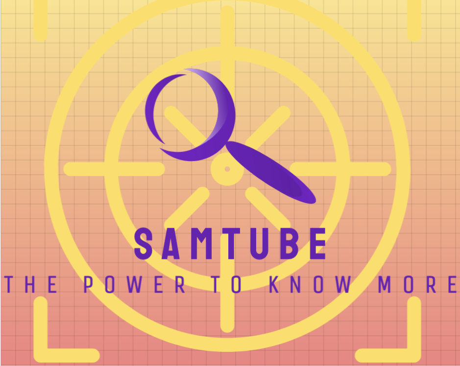

Contributors:
[Addis Jackson](https://github.com/addisjackson)
[Sung Yi](https://github.com/dreamseekerfromn)
Mikal wazeerud-din
[![Forks][forks-shield]][forks-url]
[![Stargazers][stars-shield]][stars-url]
[![Issues][issues-shield]][issues-url]
[![MIT License][license-shield]][license-url]
[![LinkedIn][linkedin-shield]][linkedin-url]


<!-- PROJECT LOGO -->
<br />
<div align="center">
  <a href="https://github.com/addisjackson/SAMtube-Prtoject">
    
  </a>

<h3 align="center">SAMtube-Project</h3>

  <p align="center">
    A youtube clone to rival its competition.
    <br />
    <a href="https://github.com/addisjackson/SAMtube-project"><strong>Explore the docs »</strong></a>
    <br />
    <br />
    <a href="https://github.com/github_username/repo_name">View Demo</a>
    ·
    <a href="https://github.com/github_username/repo_name/issues">Report Bug</a>
    ·
    <a href="https://github.com/github_username/repo_name/issues">Request Feature</a>
  </p>
</div>


<!-- TABLE OF CONTENTS -->
<details>
  <summary>Table of Contents</summary>
  <ol>
    <li>
      <a href="#about-the-project">About The Project</a>
      <ul>
        <li><a href="#built-with">Built With</a></li>
      </ul>
    </li>
    <li>
      <a href="#getting-started">Getting Started</a>
      <ul>
        <li><a href="#prerequisites">Prerequisites</a></li>
        <li><a href="#installation">Installation</a></li>
      </ul>
    </li>
    <li><a href="#usage">Usage</a></li>
    <li><a href="#roadmap">Roadmap</a></li>
    <li><a href="#contributing">Contributing</a></li>
    <li><a href="#license">License</a></li>
    <li><a href="#contact">Contact</a></li>
    <li><a href="#acknowledgments">Acknowledgments</a></li>
  </ol>
</details>


<!-- ABOUT THE PROJECT -->
## About The Project


We are elated to present to you a  media composite like none other, well, maybe one other. SAMtube is meant to be a youtube clone that has all the functionalities Youtube offers with a few more exciting ones  that we are very proud of; but all done while reflecting out style, at a speed and efficiency that rivals all other platforms


The app uses the youtube v3 api to fetch videos randomly which are then rendered on the landing page via the Main component. This component have within it the navigation bar which includes the title of the app, SAMtube, a link which would  render the most popular videos at the time it is clicked, and a search bar which allows the user to input a query which upon pressing the “Enter” key , will show videos related to this users inputted query. There is also a  link to another page aptly titled ‘About’ which tells the user about the creators of the app, their inspirations, strengths and how they came together to birth this outstanding app, SAMtube.
Once the videos are loaded, once can see its title, description, ie its counts for likes, views, comments made and favorited. The videos are tiles in a grid showing 3 videos per row in 4 columns. When the area representing the container for a video is clicked a new more detailed page is rendered for the specific video with its own unique page address that differs from others by employing that video’s id.  The new page has a larger area dedicated to viewing the videos thumbnail which is now playable. There’s also the capacity to go full screen or even to the actual youtube url for the rendered video. This detailed page also includes the option to click a like or dislike button with the changing percentage count beside it. The view count is also updated and there is an area that shows a thread of comments for that video  an  below that a form where  a comment with its author’s name can be submitted.
The app moves very quickly from view to view and is quickly updated with user inputs and after some tweaking may present itself a worthy rival to youtube itself.


<p align="right">(<a href="#readme-top">back to top</a>)</p>


### Built With

* [![Next][Next.js]][Next-url]
* [![React][React.js]][React-url]
* [![Bootstrap][Bootstrap.com]][Bootstrap-url]
* [![JQuery][JQuery.com]][JQuery-url]


<p align="right">(<a href="#readme-top">back to top</a>)</p>


<!-- GETTING STARTED -->
## Getting Started

Here's hopw you can get a copy of this great media composite app that'll blow your mind:

This is a react app completed with node modules so to start off we install the nbode package manager.

### Installation

1. In order to run the project, you need to input your own Youtube API Key which can be garnered from the google cloud api console [https://console.cloud.google.com/apis/library](https://console.cloud.google.com/apis/library). Once accessed it is then placed in the the  ‘src/api/’fetch.js file., .env and .env-development inside the root app folder. 

2. Clone the repo
   ```js
   git clone https://github.com/addisjackson/SAMtube-Project.git
   ```
3. Install NPM packages
   ```js
   npm install npm@latest
   ```
4.  Install additional pac kages for bootstrap and css stylings:
 ```js
npm install @mui/materials
npm install @mui/icons-material
npm i --save @fortawesome/fontawesome-svg-core
npm i --save @fortawesome/free-solid-icons
npm i --save @fortawesome/free-regular-icons
```
...and to install the fontawesome component install:

```js
npm install --save @fortawesome/react-fontawesome@latest
```
 Enter your API_KEY  in `fetch.js`

   ```js
   const API_KEY = 'ENTER YOUR API';
   ```


Finally to deploy the app run the command: 

```js
npm run dev
```

This will  start the localhost on your computer and deploy the app to a url that will look like 

https://localhost:5174

Once this is initialized clicking your keyboards O key will open the app in your default browser, while clicking H will bring about a help menu if needed. The app will then open in your default browser for your viewing pleasure.

<p align="right">(<a href="#readme-top">back to top</a>)</p>


<!-- USAGE EXAMPLES -->
## Usage

The App has the ability to:

 render a list of video objects accessed  from the Youtube v3 api  with the properties:
		Title
		videoId
		Description
		PublishedAt
		viewCount
		likesCount
		dislikesCount
		Comment
		commentAuthor
		commentPublishedAt
		videoThumbnail
		videoURL
access and list comment threads,  which includes the comment and any reply made to it,  for a specific video denoted by its ID.

can order the videos it renders by date or popularity.

can accept a users query and return with the most popular videos matching that  query.

[Documentation](https://developers.google.com/youtube/v3)_

<p align="right">(<a href="#readme-top">back to top</a>)</p>


<!-- ROADMAP -->
## Roadmap


See the [open issues](https://github.com/github_username/repo_name/issues) for a full list of proposed features (and known issues).

<p align="right">(<a href="#readme-top">back to top</a>)</p>


<!-- CONTRIBUTING -->
## Contributing

We would love some input from our other colleagues out there who think they can positively add to our work. If you have an idea, please:

1. Fork the Project
2. Create your Feature Branch (`git checkout -b feature/AmazingFeature`)
3. Commit your Changes (`git commit -m 'Add some AmazingFeature'`)
4. Push to the Branch (`git push origin feature/AmazingFeature`)
5. Open a Pull Request
6. We will look at your pull request and add it to project with your name as a contributor. 

Start Coding.......


<p align="right">(<a href="#readme-top">back to top</a>)</p>


<!-- LICENSE -->
## License

Distributed under the MIT License. See `LICENSE.txt` for more information.

<p align="right">(<a href="#readme-top">back to top</a>)</p>


<!-- CONTACT -->
## Contact

Addis Jackson - [addisjackson](https://www.linkedin.com/in/addisjackson/) - addisjackson@pursuit.org
Sung Yi - [sung-yi-415141149](https://www.linkedin.com/in/sung-yi-415141149/) - sungyi@pursuit.org
Mikal wazeerud-din - [](https://www.linkedin.com/in/mikal-wazeerud-din-7057a6175/)
 - mikalwazeerud-din@pursuit.org

Project Link: [https://github.com/addisjackson/SAMtube-Project](https://github.com/ddisjackson/SAMtube-Project)

<p align="right">(<a href="#readme-top">back to top</a>)</p>


<!-- ACKNOWLEDGMENTS -->
## Acknowledgments

* []()
* []()
* []()

<p align="right">(<a href="#readme-top">back to top</a>)</p>


<!-- MARKDOWN LINKS & IMAGES -->
<!-- https://www.markdownguide.org/basic-syntax/#reference-style-links -->
[contributors-shield]: https://img.shields.io/github/contributors/github_username/repo_name.svg?style=for-the-badge
[contributors-url]: https://github.com/github_username/repo_name/graphs/contributors
[forks-shield]: https://img.shields.io/github/forks/github_username/repo_name.svg?style=for-the-badge
[forks-url]: https://github.com/github_username/repo_name/network/members
[stars-shield]: https://img.shields.io/github/stars/github_username/repo_name.svg?style=for-the-badge
[stars-url]: https://github.com/github_username/repo_name/stargazers
[issues-shield]: https://img.shields.io/github/issues/github_username/repo_name.svg?style=for-the-badge
[issues-url]: https://github.com/github_username/repo_name/issues
[license-shield]: https://img.shields.io/github/license/github_username/repo_name.svg?style=for-the-badge
[license-url]: https://github.com/github_username/repo_name/blob/master/LICENSE.txt
[linkedin-shield]: https://img.shields.io/badge/-LinkedIn-black.svg?style=for-the-badge&logo=linkedin&colorB=555
[linkedin-url]: https://linkedin.com/in/linkedin_username
[product-screenshot]: images/screenshot.png
[Next.js]: https://img.shields.io/badge/next.js-000000?style=for-the-badge&logo=nextdotjs&logoColor=white
[Next-url]: https://nextjs.org/
[React.js]: https://img.shields.io/badge/React-20232A?style=for-the-badge&logo=react&logoColor=61DAFB
[React-url]: https://reactjs.org/
[Vue.js]: https://img.shields.io/badge/Vue.js-35495E?style=for-the-badge&logo=vuedotjs&logoColor=4FC08D
[Vue-url]: https://vuejs.org/
[Angular.io]: https://img.shields.io/badge/Angular-DD0031?style=for-the-badge&logo=angular&logoColor=white
[Angular-url]: https://angular.io/
[Svelte.dev]: https://img.shields.io/badge/Svelte-4A4A55?style=for-the-badge&logo=svelte&logoColor=FF3E00
[Svelte-url]: https://svelte.dev/
[Laravel.com]: https://img.shields.io/badge/Laravel-FF2D20?style=for-the-badge&logo=laravel&logoColor=white
[Laravel-url]: https://laravel.com
[Bootstrap.com]: https://img.shields.io/badge/Bootstrap-563D7C?style=for-the-badge&logo=bootstrap&logoColor=white
[Bootstrap-url]: https://getbootstrap.com
[JQuery.com]: https://img.shields.io/badge/jQuery-0769AD?style=for-the-badge&logo=jquery&logoColor=white
[JQuery-url]: https://jquery.com 
